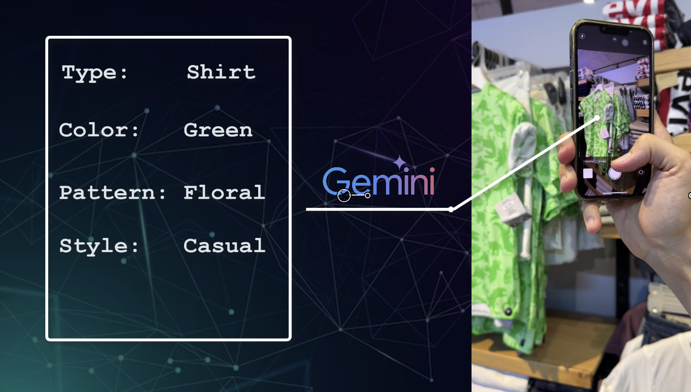
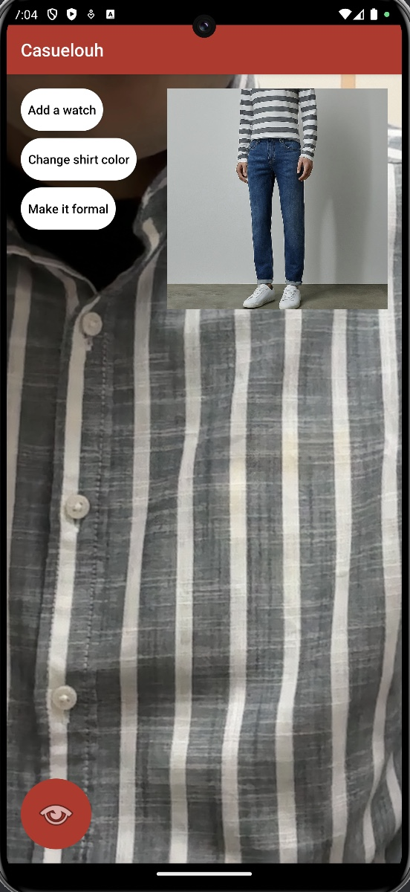
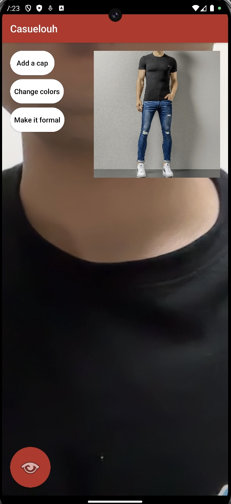

# Casuelouh

## Overview

Casuelouh is an Android App designed to help users select the perfect outfit based on various factors such as personal style, occasion or the weather.
Leveraging the capabilities of the Gemini API along with Google's computer vision and image generation algorithms, this app provides personalized outfit suggestions to enhance your daily wardrobe choices.

## How It Works

It all starts when you're thinking about your outfit. For example, you might be shopping and looking at a piece of clothing while asking questions like:
- What colors can be matching with this piece (e.g., t-shirt, blouse, ... etc.)?
- What could be good complementary pieces that can form a stylish and elegant outfit all together?
- Should I choose this or that?
- How do these two pieces look together?

Simply, you just scan that piece of clothing, and the magic happens:
- Using the Google Gemini API, the app detects all properties of the scanned clothes and suggests an elegant and consistent outfit.
  
- Using the Google Imagen API, the app generates an image of the recommended outfit.

  
- Gemini thinks like you, and suggests potential and likely touches or modifications that you might think of, so it gives you most relevant prompts so that you can quickly make edits to the outfit with a single screen touch!

  
  

## Features

- **Outfit Recommendations**: Get outfit suggestions tailored to your style, preferences, and current weather conditions.
- **Hot Prompts**: ask Casuelouh to make final touches on the recommended outfit through quick (hot) prompts! Sample prompts include (Add a jacket, remove the bow tie, replace the sneakers with leather shoes, change colors, ... etc.).
- **More Features to Come**: We are so ambitiously adding more features such as personal preferences and history to tailor the experience even more to your style and preferences.

## Installation

Coming soon on the Play Store.
